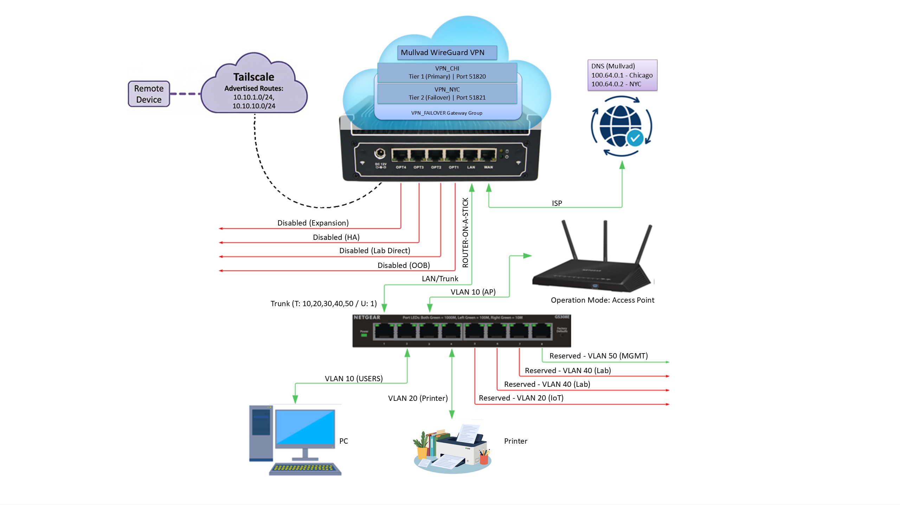
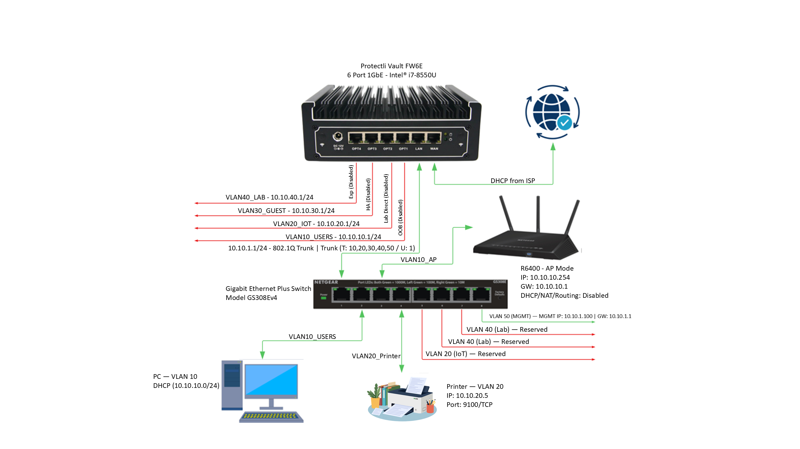

# 🏠 enterprise-homelab-pfsense-vlan

A production-grade home lab network built on pfSense 2.8.1 with full VLAN segmentation, dual-VPN failover, a 5-layer kill switch, and enterprise-style documentation. Personal use. Nothing redacted.
> Built over 6–8 months of weekend work — designed, broken, fixed, and hardened from scratch. No tutorials followed end-to-end. Every decision was researched, tested, and documented.
---


## 🔧 Hardware

| Device | Role |
|---|---|
| Protectli FW6E (i7, 16GB RAM) | Firewall / Router — pfSense 2.8.1 |
| Netgear GS308E v4 | Managed Switch (802.1Q trunk) |
| Netgear R6400 | Access Point (strict AP mode, VLAN 10) |
| Cisco Catalyst 3560 + Cisco 1900 | Lab gear — isolated on VLAN 40 |

---

## 🌐 Network Architecture

**Topology:** Router-on-a-Stick via `igb1` (Port 7) as a single 802.1Q trunk. Subnet third-octet always matches VLAN ID.

| Interface | VLAN | Subnet | Purpose |
|---|---|---|---|
| igb0 | — | DHCP/ISP | WAN |
| igb1 | 1 (Native) | 10.10.1.0/24 | Trunk / Switch management |
| igb1.10 | 10 | 10.10.10.0/24 | Trusted users, PCs, Wi-Fi |
| igb1.20 | 20 | 10.10.20.0/24 | IoT — printers, smart devices |
| igb1.30 | 30 | 10.10.30.0/24 | Guest Wi-Fi |
| igb1.40 | 40 | 10.10.40.0/24 | Cisco lab gear (fully isolated) |
| igb1.50 | 50 | 10.10.50.0/24 | Break-glass management (no VPN) |

Physical ports `igb2`–`igb5` are named and reserved for OOB, Lab Direct, HA, and Expansion.

---

## 🔒 VPN & Kill Switch

**Dual Mullvad WireGuard tunnels** with automatic failover:

- `VPN_CHI` → Chicago (Port 51820) — **Tier 1 Primary**
- `VPN_NYC` → New York City (Port 51821) — **Tier 2 Failover**
- `VPN_FAILOVER` Gateway Group handles automatic promotion

**5-Layer Kill Switch** — zero WAN exposure for internal subnets:

1. **Outbound NAT** — 12 manual rules (6 per VPN); internal subnets map *only* to VPN interfaces. Zero WAN NAT rules.
2. **DoH/DoT Block** — Alias blocks ports 443–853 to known DNS-over-HTTPS IPs.
3. **Port 53 Block** — Blocks all plain DNS toward WAN.
4. **RFC1918 Block** — Full inter-VLAN isolation (10/8, 172.16/12, 192.168/16).
5. **IPv6 Block** — All IPv6 dropped to prevent tunnel leaks.

**DNS:** Resolver bound to internal interfaces only, forwarding strictly through `VPN_CHI` and `VPN_NYC`. System DNS: `100.64.0.1` (CHI) and `100.64.0.2` (NYC). No leak path even during failover.

**VLAN 50 (MGMT)** is intentionally exempt from the VPN and RFC1918 rules — it needs direct WAN access and full internal reach for break-glass admin.

---

## 🗺️ Diagrams

| | |
|---|---|
|  |  |
| Network topology overview | VLAN & IP assignment detail |

---

## 📁 Repository Structure

```
enterprise-homelab-pfsense-vlan/
│
├── README.md
├── CHANGELOG.md
├── LICENSE
│
├── diagrams/
│   ├── network-topology-overview.png
│   └── vlan-ip-assignment-detail.png
│
├── configs/                   # Sanitized config breakdowns
│   ├── firewall-rules.md
│   ├── nat-rules.md
│   ├── vlan-assignments.md
│   ├── switch-port-map.md
│   └── vpn-failover.md
│
├── docs/                      # Full PDF manuals
│   ├── HOME_LAB_v3.pdf
│   ├── FIREWALL_RULES_MANUAL.pdf
│   └── SWITCH_VLAN_MANUAL.pdf
│
└── screenshots/               # pfSense & switch UI screenshots
```

---

## 📋 Configs

Sanitized, readable breakdowns of every major configuration area live in [`/configs`](configs/). These are meant to be human-readable references — not export files.

- [`firewall-rules.md`](configs/firewall-rules.md) — Per-VLAN rule chains, ordered top-to-bottom
- [`nat-rules.md`](configs/nat-rules.md) — All 12 manual outbound NAT rules
- [`vlan-assignments.md`](configs/vlan-assignments.md) — Interface, subnet, and purpose map
- [`switch-port-map.md`](configs/switch-port-map.md) — GS308E port-by-port PVID/tagged assignments
- [`vpn-failover.md`](configs/vpn-failover.md) — WireGuard tunnel config and gateway group logic

---

## 📄 Documentation

Full enterprise-style manuals in [`/docs`](docs/):

- [`HOME_LAB_v2.pdf`](docs/HOME_LAB_v2.pdf)
- [`FIREWALL_RULES_MANUAL.pdf`](docs/FIREWALL_RULES_MANUAL.pdf)
- [`SWITCH_VLAN_MANUAL.pdf`](docs/SWITCH_VLAN_MANUAL.pdf)

---

## ✅ Verified & Tested

- **No IP/DNS/WebRTC leaks** — confirmed via [ipleak.net](https://ipleak.net) and [Mullvad Check](https://mullvad.net/en/check) ([ipleak screenshot](screenshots/ipleak.png)) ([mullvad screenshot](screenshots/mullvad.png))
- **VPN failover** — CHI → NYC promotion confirmed under simulated failure
- **Inter-VLAN isolation** — All cross-VLAN pings blocked as expected
- **Kill switch** — Confirmed no traffic reaches WAN under any internal-subnet condition

---

## 🗺️ Roadmap

- [x] **Tailscale remote access** — Advertised routes configured and active - tested - March 11, 2026
- [ ] **Suricata IDS** — In progress; evaluating pfBlockerNG as Suricata is limited to HTTP traffic only
- [ ] **Guest Wi-Fi rate limiting** — Guest SSID active but rate limiting deferred due to hardware limitations (R6400 has no VLAN-aware SSID support); may revisit in future
- [ ] **AP hardware upgrade** — VLAN-aware AP (TP-Link EAP245 or Ubiquiti UniFi U6 Lite) not intended at this time

---

## ⚠️ Notes

- This is a personal-use lab. All IPs, configs, and keys in the full docs are real and unredacted — that's intentional.
- VLAN 40 (Lab) generates expected Cisco protocol noise; it's isolated and excluded from IDS monitoring for this reason.
- The R6400 Guest SSID currently lands on VLAN 10 — mitigated by internal guest isolation. No AP upgrade planned at this time.
